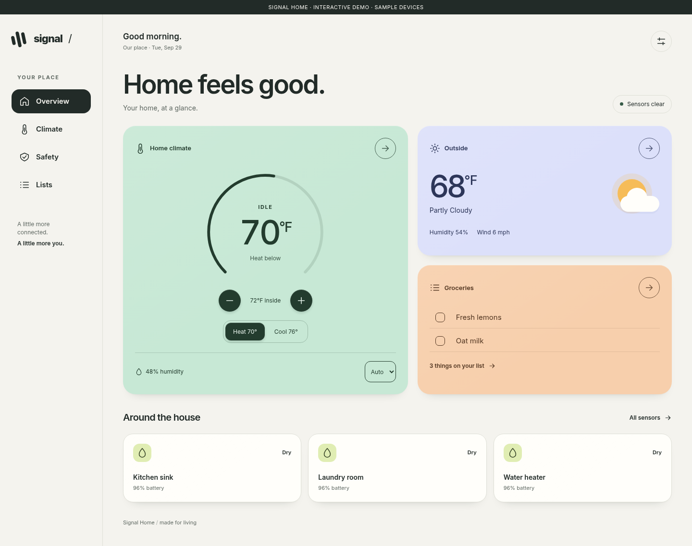
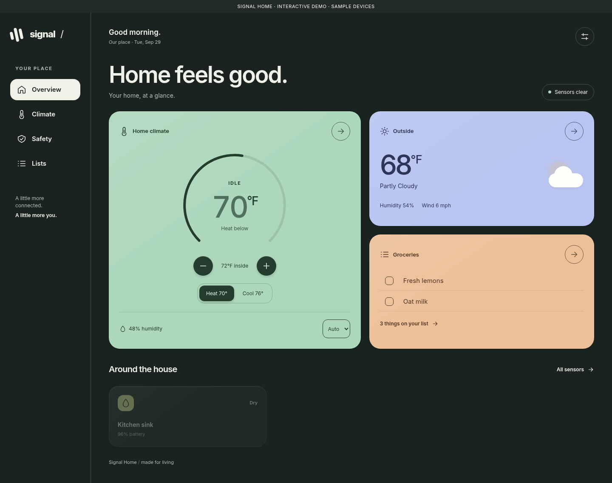
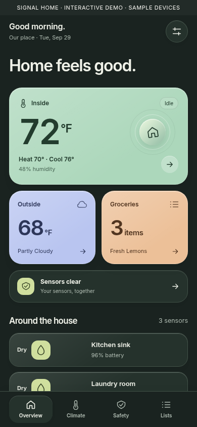
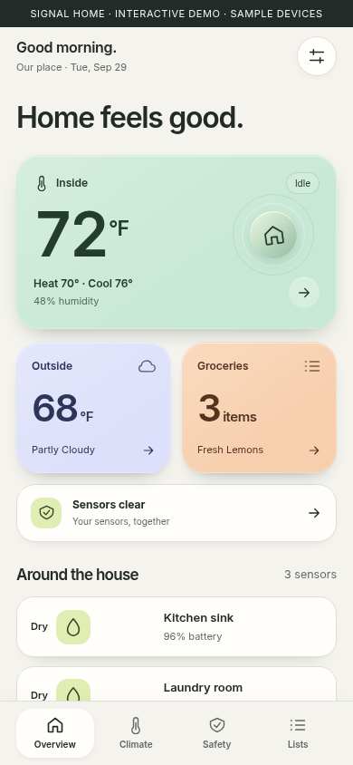
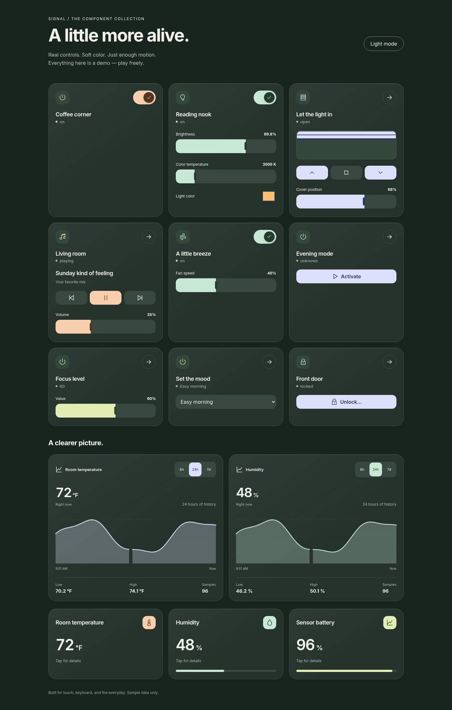

# Signal Home

A colorful, fluid dashboard for Home Assistant. Paper and ink. Bold numbers. A little motion. Made for living.



<details><summary>Dark mode and mobile previews</summary>






</details>

Signal is a self-contained Lovelace card with Overview, Climate, Safety, and Lists views. It brings a consistent interface to your browser and Home Assistant companion app, with a sidebar on desktop and a thumb-friendly dock on mobile. It doesn't replace Home Assistant's settings screens.

## Features

- Settings-only appearance: Auto (light 7am–7pm, dark overnight in HA's home time zone), System, Dark, or Light; saved per browser/device. Auto is the default.
- Phone-first overview: current room temperature, weather, groceries, and home status in whole-tile touch targets. A reserved bottom dock never covers scrolling content.
- A pinned mobile header shows a greeting (or custom address/nickname), date and home label. Content fades beneath its scrolling edge; the opaque background matches the system bars.
- Opaque, softly sculpted surfaces, springy press feedback, and detail sheets that enter from the tapped control. Spacious full controls remain on desktop.
- Animated climate dial, single target and dual heating/cooling limits, capability-aware mode selection.
- Live weather, shared grocery list with add/check-off/Undo, recently completed tasks, recoverable Older completed after 24 hours, and named safety sensors with optional battery readings.
- Tactile switches, brightness/color/temperature sliders, fans, animated blinds, media transport/volume, scenes, selectors, number controls, and confirmed unlocking.
- Recorded-history graphs with 6h/24h/7d views, pointer/keyboard inspection, and honest gaps when sensors go unavailable.
- Standalone control, graph, and metric cards with visual editors, usable in ordinary HA dashboards.
- Matching device sheets: climate controls, weather forecasts, safety history, sensor graphs, and device controls. Native HA is an explicit advanced fallback.
- Signal menu with appearance, account/sign-out, admin settings, and a standard-HA recovery link.
- Visual entity editor and YAML configuration.
- Reduced-motion support, labeled controls, keyboard focus, and phone overview layouts tested down to 320 pixels.
- One bundled JavaScript file; no separate theme, fonts, CDN, telemetry, or backend integration.

## Install with HACS

1. In HACS, open the three-dot menu → **Custom repositories**.
2. Add `https://github.com/gkgkgkgk/signal-home` with type **Dashboard**.
3. Search for **Signal Home**, download it, then refresh the browser or companion app.
4. Create a new dashboard and a **Panel** view. Add the **Signal Home** card and select your entities in its editor.

[Open this repository in HACS](https://my.home-assistant.io/redirect/hacs_repository/?owner=gkgkgkgk&repository=signal-home&category=plugin)

HACS installation is supported as a custom repository. This project has not been submitted to the default HACS catalog.

If resources are managed manually, register `/hacsfiles/signal-home/signal-home.js` as a JavaScript module. For installation without HACS, copy `dist/signal-home.js` to `/config/www/signal-home.js` and register `/local/signal-home.js`.

## Configuration

```yaml
views:
  - title: Signal
    path: home
    type: panel
    cards:
      - type: custom:signal-home
        title: Our place
        appearance: auto
        climate: climate.home
        weather: weather.home
        todo: todo.groceries
        humidity: sensor.home_humidity
        sensors:
          - entity: binary_sensor.kitchen_water
            name: Kitchen sink
            battery: sensor.kitchen_water_battery
          - entity: binary_sensor.laundry_water
            name: Laundry room
        favorites:
          - light.reading_lamp
          - scene.evening
        graphs:
          - entity: sensor.home_temperature
            name: Temperature
          - sensor.home_humidity
```

Replace entity IDs with your own. Every entity field is optional; unconfigured components show setup guidance. An unavailable sensor is explicitly marked unavailable, never reported as safe.

| Option       | Meaning                                                                                    |
| ------------ | ------------------------------------------------------------------------------------------ |
| `title`      | Home name, default `Home`                                                                  |
| `greeting`   | Optional fixed greeting; otherwise follows the time of day                                 |
| `appearance` | `auto` (default; 7am–7pm light), `system`, `light`, or `dark`                              |
| `header_label` | Optional persistent address/nickname; otherwise a greeting                           |
| `completed_retention_days` | Optional cleanup notice; use `7` only after installing the seven-day HA automation below |
| `climate`    | Climate entity                                                                             |
| `weather`    | Weather entity                                                                             |
| `todo`       | To-do entity supporting get/add/update items                                               |
| `humidity`   | Optional humidity sensor; otherwise uses climate humidity                                  |
| `sensors`    | Binary sensor IDs, or objects with `entity`, `name`, and `battery`                         |
| `favorites`  | Entity IDs rendered as capability-aware control cards                                      |
| `graphs`     | Numeric sensor IDs or objects with `entity`, `name`, and `hours` (1–168); shown on Climate |

Choose appearance in Signal's settings menu. Auto uses HA's configured time zone (device time if unavailable); System follows the device's light/dark preference. Changes apply on the next minute or app resume. Old sun/moon-button preferences are retired so this release starts from the configured/default mode. Preferences do not change other HA dashboards. Standalone cards retain their own appearance configuration.

## Shared lists and retention

To-do items belong to the configured HA entity, not the user/browser: everyone using that entity shares check-offs and restores. Signal retrieves both active and completed items. **Undo** appears immediately after a check-off; completed rows remain tappable to restore. After 24 hours they move into the collapsed **Older completed** section, not the trash. A provider's completion timestamp is authoritative. For providers without timestamps, the recent/older grouping uses first-seen time on that browser and may differ between devices; it never authorizes deletion.

For permanent deletion after seven days, install [the optional HA cleanup automation](examples/completed-cleanup.yaml), replace `todo.your_list` with your list, and set `completed_retention_days: 7` on the card to show the retention notice. **This automation permanently deletes items** on its hourly run after seven days. It works while the app is closed, requires a provider supplying completion timestamps, rechecks each item before deletion, and skips missing/invalid timestamps. Restoring an item protects it from cleanup; completing it again starts a new retention period. The frontend itself never automatically deletes tasks. Without this automation, older completed items remain recoverable indefinitely.

The card works in Sections, but its complete navigation and layout are designed for a Panel view.

## Immersive dashboard

For one navigation system, install [Kiosk Mode](https://github.com/NemesisRE/kiosk-mode) through HACS and use this **dashboard-level** setting (not inside the card):

```yaml
kiosk_mode:
  hide_header: true
  hide_sidebar: true
views:
  - title: Signal
    path: home
    type: panel
    cards:
      - type: custom:signal-home
        immersive: true
        # Your entity configuration goes here.
```

Kiosk Mode is optional and separately installed. `immersive: true` adjusts Signal's viewport layout and matches the surrounding page/status-bar colors to Signal; it does not hide HA by itself. Use a Kiosk Mode version compatible with your HA version. This setup applies only to the dashboard where you add it—do not use Kiosk Mode's global query-string caching.

In immersive mode, Signal temporarily supplies the root theme colors read by the Android and iOS companion apps and sends HA's [`theme-update` message](https://developers.home-assistant.io/docs/frontend/external-bus/#theme-update) through the existing app bridge. Browser theme-color metadata follows too. The colors track Signal's selected appearance mode and are released when you leave the dashboard or use recovery. Your saved HA theme and server-wide default are not changed. This matches the native frame; it does not force fullscreen, hide system indicators, or change native edge-to-edge settings. Actual system-bar behavior depends on the companion app and OS version.

The Signal menu's **Open standard Home Assistant** link reloads the same dashboard with `?disable_km`, restoring HA navigation and the editor. Bookmark that recovery URL. Remove the parameter to return to immersive mode. Account/sign-out opens HA's native profile; settings are shown for administrators. Authentication, sessions, permissions, and companion-app onboarding remain entirely with HA. Hiding navigation is not access control.

Device details use touch-friendly bottom sheets on phones and centered dialogs on desktop. Close with the close button, Escape, browser Back, a backdrop tap, or a downward swipe on the heading. Focus stays within the native modal and returns to the trigger. **Advanced in Home Assistant** deliberately opens the native dialog for unsupported capabilities and device administration.

## Build your own dashboard

All four cards are registered in Home Assistant's card picker. Use `custom:signal-home` for the full dashboard or mix these standalone cards into a Sections view:

```yaml
type: custom:signal-control
entity: light.reading_lamp
name: Reading nook
accent: mint
appearance: auto
```

`signal-control` supports lights, switches, fans, input booleans, covers, media players, scenes, scripts, buttons, input buttons, numbers, input numbers, selects, input selects, and locks. Unsupported entities retain a details button. Controls follow advertised device capabilities. Sliders preview while dragging and send on release; service errors remain visible. Unlocking needs confirmation; locks requiring a PIN should use native details.

```yaml
type: custom:signal-graph
entity: sensor.home_temperature
name: Room temperature
hours: 24
accent: lilac
appearance: auto
```

Graphs read Recorder history, not invented values. The configured entity must have numeric recorded history. Raw-history retention determines what is available; this card does not request long-term statistics. Dense histories are reduced for drawing while low/high values use the complete response. Graphs refresh once a minute while the page is visible.

```yaml
type: custom:signal-metric
entity: sensor.home_humidity
name: Humidity
min: 0
max: 100
accent: lime
appearance: auto
```

Metrics open a Signal history sheet. Set `max` (and optionally `min`) to add a bounded meter. All standalone cards support `mint`, `lilac`, `apricot`, and `lime` accents and `auto`, `light`, or `dark` appearance. Auto follows the device/browser color preference.



## Development

Node.js 22.12+ or 24 is recommended.

```sh
npm ci
npm run dev
npm run build
npx playwright install chromium
npm test
```

`npm run dev` opens an interactive demo with sample entities; `/components.html` is the component playground. Demo interactions never connect to a real home. Set `CHROMIUM_PATH` to use an existing browser. Tests cover climate service payloads and bounds, controls, release-only slider commands, lock confirmation, recorded-history parsing/gaps/cursors, unavailable states, error handling, groceries, dark-mode persistence, and responsive/reduced-motion behavior.

Source lives in `src/`. `src/demo.ts` is excluded from the production bundle. `dist/signal-home.js` is the HACS artifact. Update the package version, build, commit source plus `dist`, then create a GitHub release with the matching tag. The release workflow rebuilds and attaches the bundle.

## Scope

Signal uses the authenticated Home Assistant frontend connection. Home Assistant remains responsible for device authorization and actions. Safety cards are status displays; they do not implement alarm notifications. Device integration behavior and delayed state updates may vary.

The suite covers everyday controls, climate, weather, groceries, safety, numeric history, and matching device sheets. Camera walls, room auto-discovery, alarm-panel controls, and translations remain future work. Signal styles its own interface, not Home Assistant's settings screens or native advanced dialogs.

[Design notes](DESIGN.md) · [MIT license](LICENSE)
